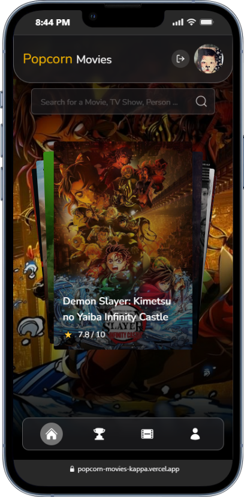
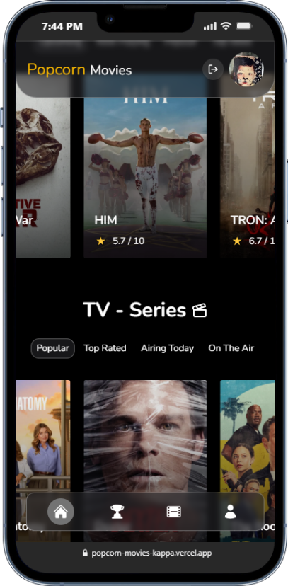
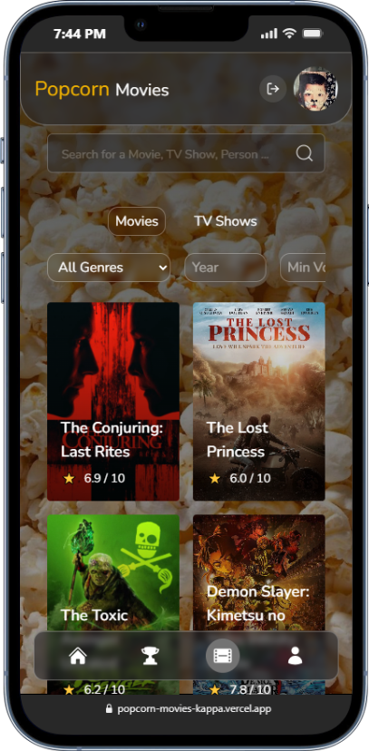
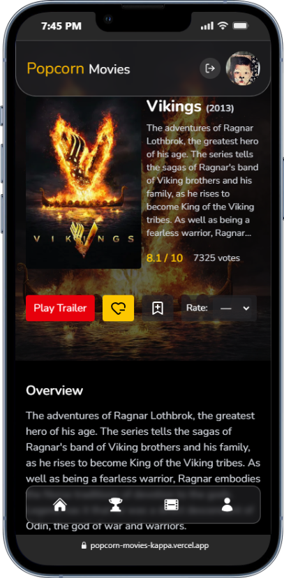

# 🍿 Popcorn Movie — MVP in Progress

**Popcorn Movie** is an evolving movie discovery web app built with modern React practices and powered by the [TMDB API](https://www.themoviedb.org/documentation/api).  
This project serves as an **MVP** (Minimum Viable Product) and a **showcase of my front-end development skills**, continuously improving over time.

---

## 🚀 Live Demo
🔗 [popcorn-movies-kappa.vercel.app](https://popcorn-movies-kappa.vercel.app/)

<h3 align="center">📱 Movie App Screenshots</h3>

<br/>

<p align="center">
  
  
  
  
</p>

---

## 🧠 About the Project
This project is part of my ongoing journey in front-end development.  
It’s designed to demonstrate clean architecture, API integration, and modern UI/UX techniques — while constantly evolving as I experiment with logic, design, and scalability.

**Main goals:**
- Showcase real API integration (TMDB)
- Practice modular, maintainable React architecture
- Iterate over design & logic for better performance and UX

---

## ⚙️ Tech Stack

| Category | Tools |
|-----------|--------|
| **Framework** | [React](https://reactjs.org/) |
| **Styling** | [Tailwind CSS](https://tailwindcss.com/), Custom Components |
| **Routing** | [React Router DOM](https://reactrouter.com/) |
| **API** | [TMDB API](https://developer.themoviedb.org/docs) |
| **HTTP Client** | Axios / Fetch |
| **Build Tool** | Vite |
| **Deployment** | Vercel |
| **Version Control** | Git + GitHub |

---

## 🎬 Features
- 🔍 **Browse movies and TV shows** in real-time from TMDB API  
- 🧠 **Detailed cast and actor pages** with info and filmography  
- ⭐ **Watchlist creation and management**  
- 🧩 **Reusable UI components** and custom hooks for data fetching  
- 🌓 **Responsive, modern design** (built with Tailwind)  
- ⚡ **Fast and optimized performance** via Vite and code-splitting  
- 🔄 **Constantly improving logic and UX** as development continues  

---

## 📅 Roadmap / Future Plans
This is a continuously evolving project — new features, UI improvements, and logic refinements are added regularly.

- [x] Basic movie & actor browsing  
- [x] Watchlist feature  
- [ ] Authentication system  
- [ ] User profile & favorites persistence  
- [ ] Filtering & sorting options  
- [ ] UI redesign & animations (Framer Motion)  
- [ ] Trailer player & recommendations  

---

## 🧰 Skills Demonstrated
- React component design & state management  
- API integration & async data handling  
- Responsive design with Tailwind CSS  
- Version control workflow (Git + GitHub)  
- Real-world app architecture & modular logic  
- Deployment & CI/CD with Vercel  

---

## 🧪 Development Setup

Clone the repo and install dependencies:

```bash
git clone https://github.com/arefrhnm1/popcorn-movie.git
cd popcorn-movie
npm install
```
Run locally:

```bash
npm run dev
```
Build for production:
```bash
npm run build
```
Create a env. file for your TMDB key:
```bash
VITE_TMDB_API_KEY=your_tmdb_api_key
```

---

## 🧑‍💻 Author
Aref Rahnama
- Frontend Developer — exploring UI, architecture, and API-driven apps.
- 📍 Continuously improving Popcorn Movie as a live project.


 ---

 ## 🇮🇷 درباره پروژه (فارسی)

پروژه Popcorn Movie یک اپلیکیشن وب برای جست‌وجو و نمایش اطلاعات فیلم‌هاست که با استفاده از React و Tailwind CSS ساخته شده و داده‌های خود را از TMDB API دریافت می‌کند.

🎯 هدف اصلی این پروژه نمایش مهارت‌های من در زمینه‌ی توسعه‌ی فرانت‌اند است — از طراحی ماژولار و معماری تمیز گرفته تا تعامل با API واقعی و بهینه‌سازی رابط کاربری.

- 🔹 این پروژه در حال توسعه است و منطق و طراحی آن به مرور زمان بهبود پیدا می‌کند.
- 🔹 ویژگی‌هایی مثل واچ‌لیست، صفحه بازیگران، فیلترها و حالت تیره/روشن در حال گسترش هستند.
- 🔹 از آن‌جایی که این پروژه یک MVP از یک ایده‌ی بزرگ‌تر است، در آینده قابلیت‌های بیشتری مثل ورود کاربر، ذخیره‌سازی داده‌ها و توصیه فیلم‌ها اضافه می‌شود.

🧩 این پروژه به عنوان یک نمونه‌ی زنده از مسیر رشد من در توسعه‌ی فرانت‌اند ساخته شده و به مرور کامل‌تر میشود.
